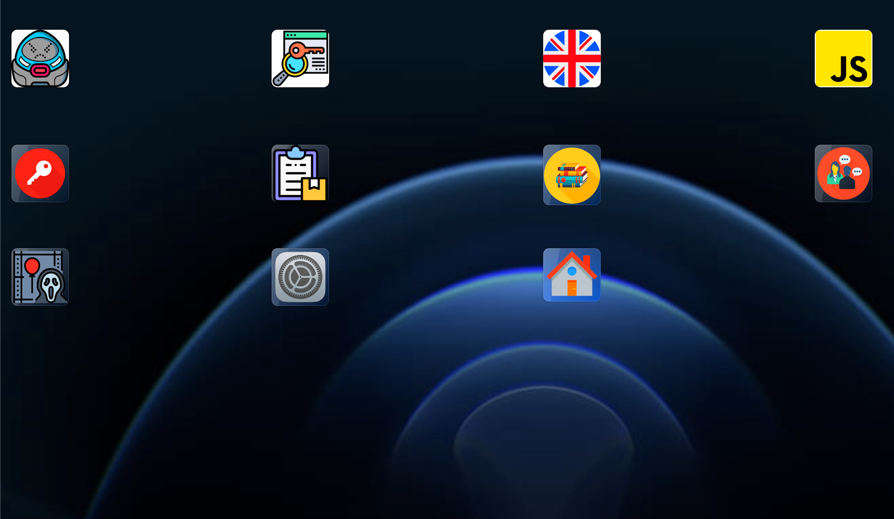

<p align="center" dir="auto">
<a rel="noopener noreferrer" href="https://maispace.netlify.com" target="_blank">
</a></p>
<h2 align="center" dir="auto">mAIspace is a single-page app for users to interact with AI. 9 different apps were created with AI about various subjects and with different returns each time.<br>👨‍💻 🤖 🦾 🧙‍♂️</h2>

<br>
<br>

## User Stories

- **Sign up** - As a user, I want to sign up.
- **Login** - As a user, I want to be able to log in.
- **Logout** - As a user, I want to be able to log out.
- **Profile** - As a user, I want to be able to see my profile.
- **Edit Profile** - As a user, I want to be able to edit my profile.
- **Delete Profile** - As a user, I want to be able to delete my account.
- **Home** - As a user, I want to access the home page.
- **App:** As a user, I want to access all the apps page.
- **App Name:** As a user, I want to access the app's page.

<br>
<br>

# Client / Frontend

## React Router Routes (React App)

| Path               | Page       | Permissions                | Behavior                                          |
| ------------------ | --------------- | -------------------------- | ------------------------------------------------- |
| `/login`           | LoginPage       | anon only `<AnonRoute>`    | Login form, navigates to home page after login.   |
| `/signup`          | SignupPage      | anon only `<AnonRoute>`    | Signup form, navigates to home page after signup. |
| `/`                | HomePage        | public `<Route>`           | Home page.                                        |
| `/profile`         | Profile     | user only `<PrivateRoute>` | User and player profile for the current user.     |
| `/profile/edit`    | EditProfile | user only `<PrivateRoute>` | Edit user profile form.                           |
| `/apps`          | Apps             | user only `<PrivateRoute>` | Apps form.                                         |
| `/:apps/:appName` | App Name  | user only `<PrivateRoute>` | App cards.                                 |


<br>

## Components

Pages:

- LoginPage

- SignupPage

- HomePage

- ProfilePage

- EditProfilePage

- Apps

- App/appName


<br>

# Server / Backend

## Models:

<br>

**User model**

```javascript
{
  name: { 
    type: String, 
    required: true
    }
  email: { 
    type: String, 
    required: true, 
    unique: true 
    },
  password: { 
    type: String, 
    required: true 
    },
  profileImg: {
      type: String,
      default: 'https://res.cloudinary.com/dvzekm9zq/image/upload/v1660147231/cards/avatar_bpem8o.png'
    },
  field: { 
    type: String, 
    required: true,
    enum: ['Fun', 'Business', 'Programmer', 'Teacher']},
    createdResults: [{ type: Schema.Types.ObjectId, ref:'Requests' }]

}
```

**App model**

```javascript
 {
   appDescription: { type: String },
   appName: { type: String }
 }
```


**Result model**

```javascript
  {
    appName: { type: String },
    userInput: { type: String },
    result: { type: String }
  }

```

<br>

## API Endpoints (backend routes)

| HTTP Method | URL                    | Request Body                 | Success status | Error Status | Description                                                                                                                     |
| ----------- | ---------------------- | ---------------------------- | -------------- | ------------ | ------------------------------------------------------------------------------------------------------------------------------- |
| POST        | `/auth/signup`         | {name, email, password, field, profileImg}      | 201            | 404          | Checks if fields not empty (422) and user not exists (409), then create user with encrypted password, and store user in session |
| POST        | `/auth/login`          | {email, password}         | 200            | 401          | Checks if fields not empty (422), if user exists (404), and if password matches (404), then stores user in session              |
| GET         | `/profile/:id`     |                              |                |              | show specific profile                                                                                                            |
| PUT         | `/editprofile/:id`     | { name, profileImg }                | 201            | 400          | edit profile                                                                                                                     |
| DELETE      | `/profile/:id`     |                              | 200            | 400          | delete profile                                                                                                                   |
| GET         | `/app`             |                              |                | 400          | Show all apps                                                                                                            |
| POST        | `/app`             | { model, prompt, temperature, max_tokens, top_p, frequency_penalty, presence_penalty }       | 201            | 400          | Create and save a new app                                                                                                |
| GET         | `/app/:appName`         |                              |                |              | Show specific app                                                                                                        |
| POST        | `/app/:appName` | {appName, question } |                |              | add results                                                                                                                     |

<br>
<br>


<br>


<br><h1 align="center" dir="auto"><strong>mAIspace</strong></h1>


<a href="https://maispace.netlify.com" target="_blank">
</a>


<br><br>

## API

<a href="https://openai.com/api/">OpenAI</a>

<br>


## Git

[Client Repository](https://github.com/lzaquine/mAIspace-client)

[Server Repository](https://github.com/lzaquine/mAIspace-server)

[Deployed App](https://maispace.netlify.app)

<br>


### Contributors

⚒️ Lucas Zaquine - [GitHub](https://github.com/lzaquine) - [LinkedIn](https://www.linkedin.com/in/lucaszaquine/)
